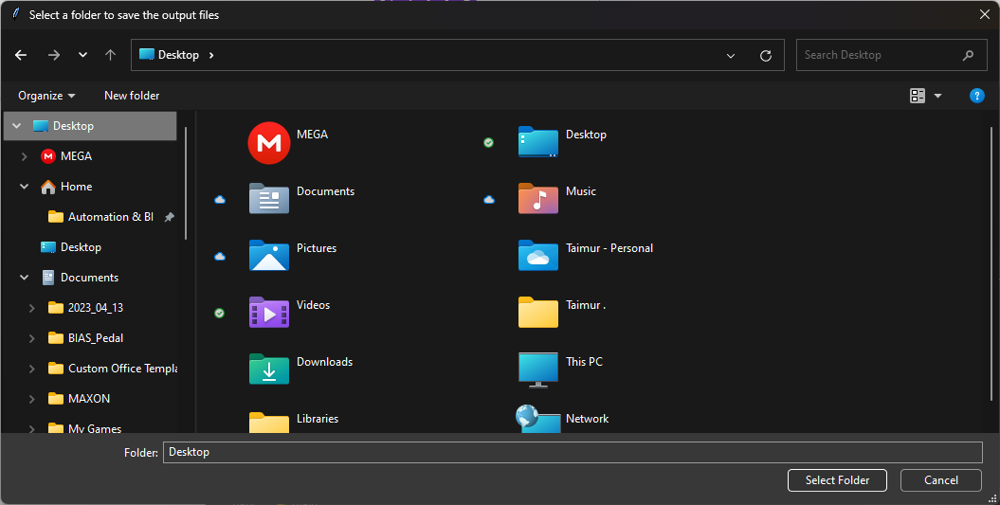

# Financial statements downloader
This Python script downloads financial statements (balance sheet, income statement, 
and cash flow statement) and other publicly available information via Yahoo! Finance  for 
listed companies.

### How to use?
1. You need Python installed on your PC  (use Microsoft Store or any other IDE of choice)
   and run 'main.py'

2. Enter tickers/symbols in code.country format [e.g., 4300.SR] in 'main.py'
   (browse https://finance.yahoo.com/ to find ticker(s) of interest)
   
    `tickers = ['4300.SR', '4240.SR', '####.XY']`

3. Select a folder to save financial statements in Excel format:

   

That's it.