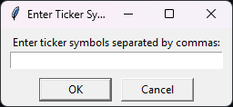
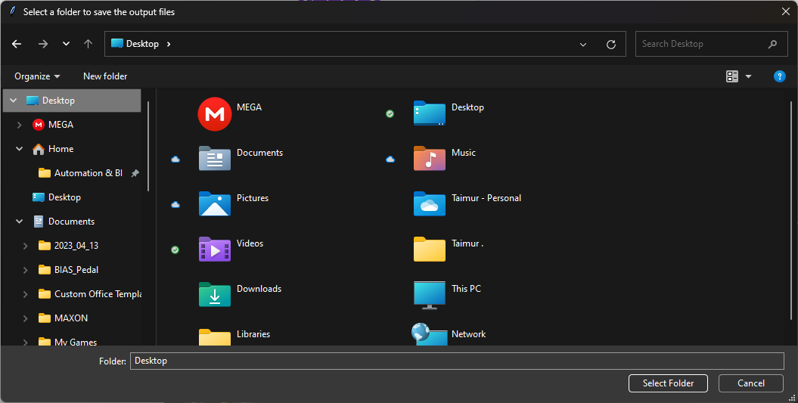

# Financial statements downloader
This Python script downloads financial statements (balance sheet, income statement, and cash flow statement) and other publicly available information via Yahoo! Finance for listed companies.

# How to use?
1. Enter tickers/symbols in code.country format [e.g., 4300.SR]. Visit https://finance.yahoo.com/ to find ticker(s) of interest.

2. Select a folder to save financial statements in Excel format:

That's it.